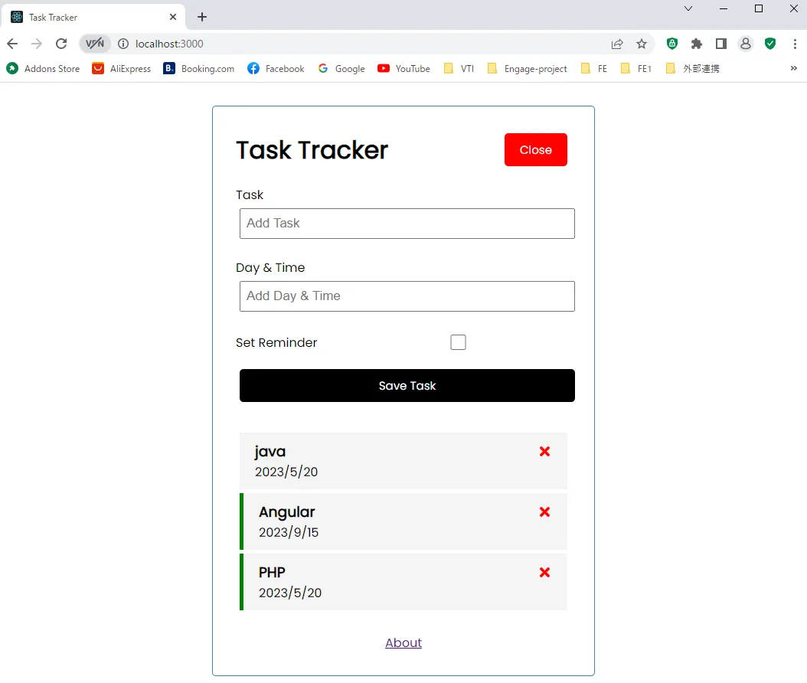

# React Task Tracker App

Task Tracker App (React) with JSON-server for our mock backend

## Usage

### Git Clone

```
git clone https://github.com/ChamomileTommy/react-tasks-tracker-dbjson.git
```

### Go to folder react-tasks-tracker-dbjson

```
cd react-tasks-tracker-dbjson
```

### Install dependencies

```
npm install
```

### Run React dev server (http://localhost:3000)

```
npm start
```

### Run the JSON server (http://localhost:5000)

```
npm run server
```

### To build for production

```
npm run build
```

## Demo



## 🚀 About Me

I'm a full stack developer for 4 years
